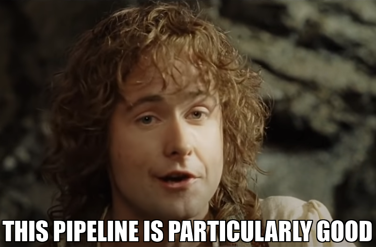

# Peregrin

| Tests | Coverage | Documentation |
| :---: | :------: | :-----------: |
|  |  |  |

Peregrin is an end-to-end, supernova cosmology, analysis pipeline, and the successor to the [Pippin](https://github.com/dessn/pippin) analysis pipeline. It's like Pippin, but fancier.

